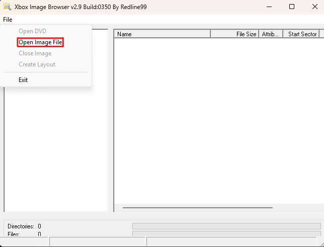
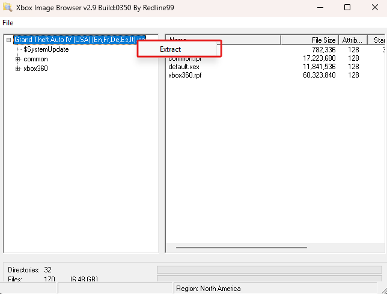

# Grand Theft Auto IV Debug (Bankrelease) Setup Guide *For Xenia Canary*

## Requirements
- A copy of Grand Theft Auto IV for the Xbox 360.
- GTAVSP.7z - Source Code or the P1 Torrent.
   - This is required for the RAG.
   - GTAVSP.7z SHA1 Hash: `ca39323730ed644fa534a2946506d4287f92a799`
   - GTAVSP.7z Password: `Mi76#b>9mRed`
- [Xenia Canary](https://github.com/xenia-canary/xenia-canary)
- [Proxy to connect the RAG](https://github.com/Los-Santos-Online/GTA-IV-RAG-MITM-Proxy/releases/)
- [Patch for Xenia Canary to run the build
](https://github.com/Los-Santos-Online/GTAIVBankreleaseNativeCompat/releases/)
- [Xbox 360 Image Browser](https://digiex.net/threads/xbox-360-image-browser-2-9-0-350-xiso-browser-and-extractor.3136/)
   - To extract your game `.iso` to loose files.
 
## Extracting the game

- If your game is in `.iso` format use the [Xbox 360 Image Browser](https://digiex.net/threads/xbox-360-image-browser-2-9-0-350-xiso-browser-and-extractor.3136/) to extract your game to loose files.

 1. Press on "File" then "Open Image File" then select your GTA IV `.iso` file.
<div style="text-align:center;">

</div>

 2. After it loads, right-click on the `.iso` file name and press extract, then select a new folder to extract the game to.
 
<div style="text-align:center;">

</div>

 ## Patching the game 
  1. Copy `gta4bankrelease_xenon.xex` and `gta4beta_xenon.xex` to your game directory.
  2. Create a new text file called `commandline.txt` and add this inside.
  ```
  -rag -ragaddr YOUR IP4
  
  ```
   - Replace `YOUR IP4` with your computer's IP4.
   - You can remove the `commandline.txt` completely if you don't want to use the RAG, then you also won't need the [Proxy](https://github.com/FranklinClintonDev/gta-iv-debug-on-xenia-guide/blob/main/README.md#setting-up-the-proxy).
   
 ## Setting up Xenia Canary
  1. Download and extract [Xenia Canary](https://github.com/xenia-canary/xenia-canary)
  2. Boot Xenia Canary one time to create the config files.
  3. Edit `xenia-canary.config.toml` and change the following options:
  ```
writable_code_segments = true
allow_plugins = true
allow_game_relative_writes = true
keyboard_mode = 2
allow_incompatible_title_update = true
console_type = 0
enable_console = true
force_mount_devkit = true
  ``` 
  4. Create a folder called `Plugins` inside the Xenia Canary folder then, inside that folder, create a folder called `54540816`.
  5. In the new `54540816` folder create a new text file and name it `plugins.toml`, then paste this inside of it:
  ```
  title_name = "GTA IV Bankrelease"
title_id = "54540816"

[[plugin]]
name = "GTAIVBankreleaseNativeCompat"
file = "GTAIVBankreleaseNativeCompat_xenia.xex"
hash = "ENTER HASH HERE"
desc = "Registers retail-only native aliases for gta4beta_xenon.xex"
is_enabled = true


[[plugin]]
name = "GTAIVBankreleaseNativeCompat"
file = "GTAIVBankreleaseNativeCompat_xenia.xex"
hash = "ENTER HASH HERE"
desc = "Registers retail-only native aliases for gta4bankrelease_xenon.xex"
is_enabled = true
  ```

## Detect the hashes for "gta4bankrelease_xenon.xex" and "gta4beta_xenon.xex" to add them to "plugins.toml":

1. Open your Xenia Canary configuration file (`xenia-canary.config.toml`) and ensure your `log_level` is set to at least `2`. 
2. Run `gta4beta_xenon.xex` at least once through the emulator, then close it. 
3. Open the `xenia.log` file generated in your emulator directory.
4. Press Ctrl + F and search for `Module Hash:`
5. Enter that hash in your `plugins.toml` at the first `"ENTER HASH HERE"` placeholder.
6. Delete `xenia.log` and repeat the process for `gta4bankrelease_xenon.xex` and paste the hash in the second  `"ENTER HASH HERE"` placeholder inside `plugins.toml`.
  
  6. Download this [patch for Xenia Canary](https://github.com/Los-Santos-Online/GTAIVBankreleaseNativeCompat/releases/) then put the `GTAIVBankreleaseNativeCompat_xenia.xex` in `Plugins/54540816`.

## Creating X:\ Drive

1. Create a new folder anywhere you want  
2. Inside the folder, create a folder called `gta5`  
3. Copy all content from `GTAVSP.7z/GTAV Source` folder to `gta5`  
    - Optionally you can skip step 1-3 and just use the `gta5` folder from the `P1` Torrent.
4. Copy the two `.bat` files from the [`GTA V - X Drive Batch files`](https://github.com/FranklinClintonDev/gta-v-source-code-guide/tree/main/GTA%20V%20-%20X%20Drive%20Batch%20Files) folder to your new folder  
5. Run `Connect_X_Drive.bat`  
6. Right-click on the gta5 folder, turn off the "Read-Only" option, then press "Apply"

## Patching the RAG/Tools

1. Run `X:\gta5\src\dev_ng\All_In_One_Install_Environment_Variables.bat`  
2. Run `X:\gta5\src\dev_ng\setenv.bat`
3. Copy all folders from [`dll_patches_x.zip`](https://github.com/FranklinClintonDev/gta-v-source-code-guide/tree/main/GTA%20V%20-%20Source%20Code%20Patches/tools%20patch) to `X:\gta5\tools_ng\bin`, making sure to overwrite any existing files.
4. Open `X:\gta5\tools_ng\etc\globals\studios.meta` and change SubnetMask to your IP4 but replace the last digit of your IP with 0 and put /24 at the end.

Example:
192.168.0.96 → `<SubnetMask>192.168.0.0/24</SubnetMask>`

## Setting up the Proxy

1. Download [`RagProxyCompat.exe`](https://github.com/Los-Santos-Online/GTA-IV-RAG-MITM-Proxy/releases/) 
2. Open a PowerShell window in the same path as your `RagProxyCompat.exe` and run:
```
./RagProxyCompat.exe --listen-address 0.0.0.0 --listen-port 2001 --target-address 127.0.0.1 --target-port 2000
```
- You need to open the Proxy every time before you want to open the game.

## Open the game:

- Make sure the Proxy is running.

1. Launch `x:/gta5/tools_ng/bin/rag/rag.exe`.
2. Open Xenia Canary then drag and drop `gta4bankrelease_xenon.xex` or `gta4beta_xenon.xex` inside your window to boot the game.

- It may take some time to load but the game and RAG will open.

## Notes:
- `-noambient` breaks the game.

## Credits

#### Thanks to [realweezerfan93](https://github.com/rwf93) for creating the Xenia Canary patch to run the game.

#### Thanks to [Jorby](https://github.com/coldreactor64) for creating the Proxy that enables us to use RAG.

#### Thanks to Gonzo for helping me set up the plugins correctly.

#### Thanks to [janmatant](https://github.com/jncroisthoirfinn) for releasing the devkit dump where these game builds were discovered.

#### Thanks to andre also known as Funtimeandrefoxy for extracting the devkit files.

#### Thanks to everyone in the community for helping me set up this build.

---------------------------------------------------------------------
### If you need any help feel free to ask in our Discord server https://discord.com/invite/Yd3YamEAYK
